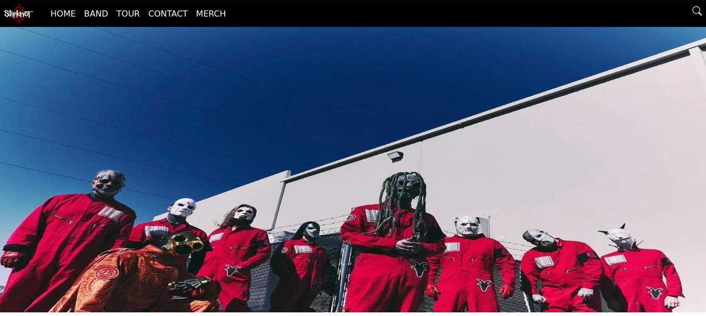
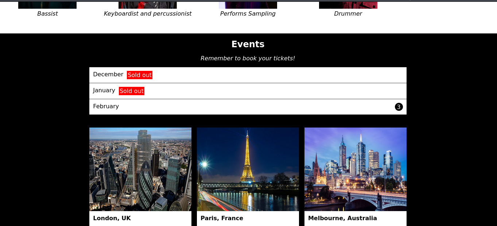
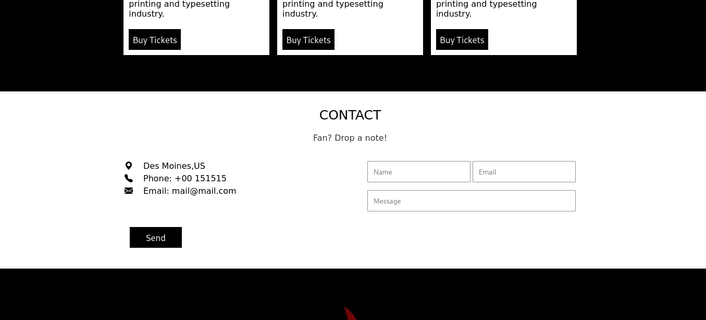
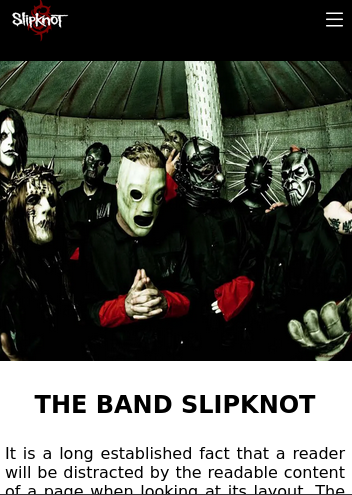
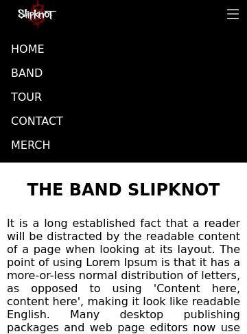
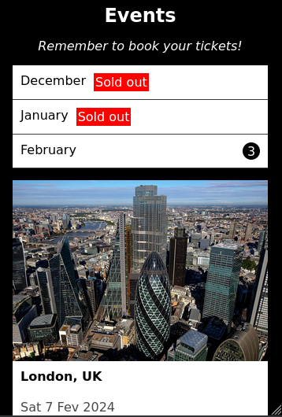

  <h1>Site sobre Slipknot</h1>
    
    
    
     
     
     

Este o design de uma página web sobre à banda Slipknot, desenvolvida com base em um template do site W3Schools. O menu hambúrguer disponível na versão mobile, permite acessar uma lista de opções ao ser clicado. Além disso, foi utilizada a função setInterval do JavaScript para alternar automaticamente entre três imagens da banda a cada 5 segundos.

  
Desenvolvido por <a target="_blank" rel="external" href="https://github.com/MegMinnie/"><strong>Mirele Oliveira da Silva</strong></a>

 

 

  
  ## Como Acessar a Aplicação

Acesse a aplicação por meio do link: <a href="https://megminnie.github.io/Site-Slipknot/
"_blank">clique aqui</a>

## Screenshots
**Desing - Versão Desktop:**

**Design - Versão mobile:**
 

